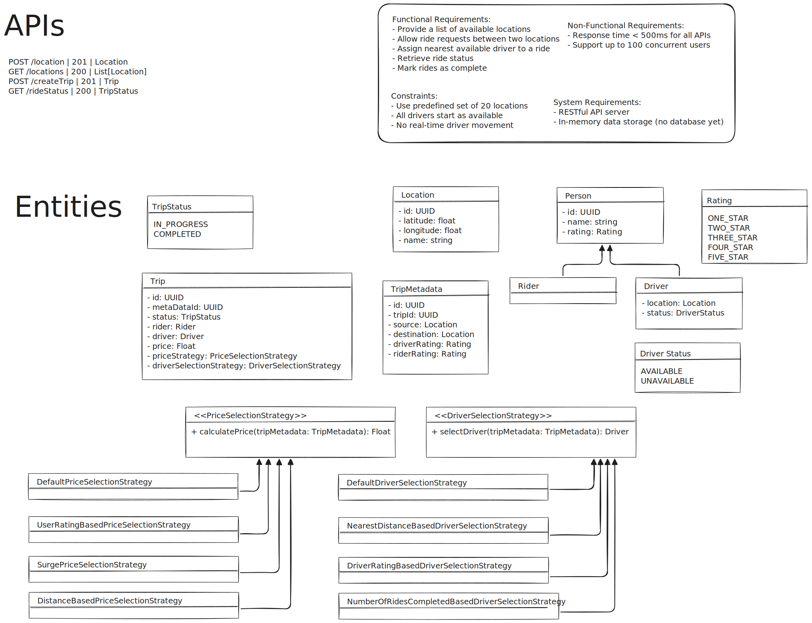

# Uber Simulation API

[](https://github.com/parthasarathydNU/uber-ride-api/actions/workflows/main.yml)

## Overview

This project is an API for simulating an Uber-like ride-hailing service. It provides endpoints for managing various aspects of the system, including locations, drivers, passengers, and rides.



## Features

- **Locations API**: Manage pickup and drop-off locations
- **Drivers API**: Handle driver information and availability
- **Passengers API**: Manage passenger profiles and ride history
- **Rides API**: Create, track, and manage ride requests

## Technology Stack

- FastAPI
- Python 3.9+
- Docker
- PostgreSQL (for production)

## Getting Started

### Prerequisites

- Docker and Docker Compose
- Python 3.9 or higher (for local development)

### Installation

1. Clone the repository:
   ```
   git clone https://github.com/yourusername/uber-simulation-api.git
   cd uber-simulation-api
   ```

2. Build and run the Docker containers:

Build the development Docker image
`docker build -t uber-api-dev -f Dockerfile.dev .`

Run the development Docker container
```shell
docker run -d \
  --name uber-api-dev \
  -p 8000:8000 \
  -v $(pwd)/app:/code/app \
  uber-api-dev
```

Build the production Docker image
`docker build -t uber-api-prod -f Dockerfile.prod .`

Run the production Docker container
```shell
docker run -d \
  --name uber-api-prod \
  -p 8000:8000 \
  uber-api-prod
```

3. The API will be available at `http://localhost:8000`

### Running Tests

To run the tests using Docker:

```
docker-compose -f docker-compose.test.yml up --build
```

## API Documentation

Once the server is running, you can access the interactive API documentation at:

- Swagger UI: `http://localhost:8000/docs`
- ReDoc: `http://localhost:8000/redoc`

## API Endpoints

### Locations API

- `GET /api/v1/locations`: List all locations
- `POST /api/v1/locations`: Create a new location
- `GET /api/v1/locations/{location_id}`: Get details of a specific location
- `PUT /api/v1/locations/{location_id}`: Update a location
- `DELETE /api/v1/locations/{location_id}`: Delete a location
- `GET /api/v1/locations/nearest`: Find the nearest location

### Drivers API (TODO)

- `GET /api/v1/drivers`: List all drivers
- `POST /api/v1/drivers`: Register a new driver
- `GET /api/v1/drivers/{driver_id}`: Get driver details
- `PUT /api/v1/drivers/{driver_id}`: Update driver information
- `DELETE /api/v1/drivers/{driver_id}`: Remove a driver from the system

### Passengers API (TODO)

- `GET /api/v1/passengers`: List all passengers
- `POST /api/v1/passengers`: Register a new passenger
- `GET /api/v1/passengers/{passenger_id}`: Get passenger details
- `PUT /api/v1/passengers/{passenger_id}`: Update passenger information
- `DELETE /api/v1/passengers/{passenger_id}`: Remove a passenger from the system

### Rides API (TODO)

- `POST /api/v1/rides`: Request a new ride
- `GET /api/v1/rides/{ride_id}`: Get ride details
- `PUT /api/v1/rides/{ride_id}`: Update ride status
- `GET /api/v1/rides`: List rides (with filtering options)

### Contributing

1. Fork the repository
2. Create your feature branch (`git checkout -b feature/AmazingFeature`)
3. Commit your changes (`git commit -m 'Add some AmazingFeature'`)
4. Push to the branch (`git push origin feature/AmazingFeature`)
5. Open a Pull Request

## License

This project is licensed under the MIT License - see the [LICENSE](LICENSE) file for details.

## Contact

Dhruv Parthasarathy - parthasarathy.d@northeastern.edu
